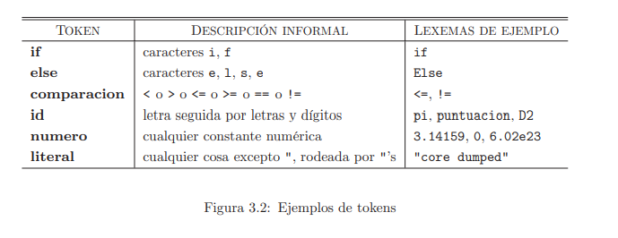
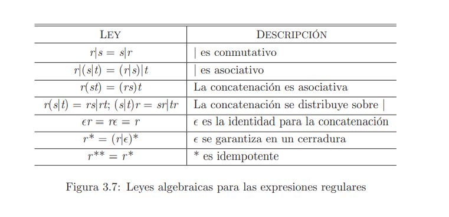
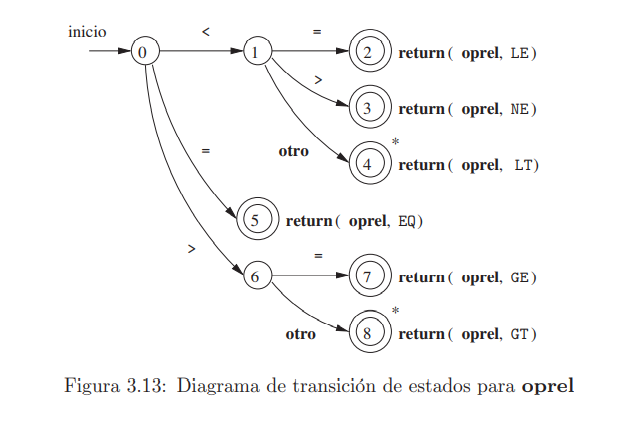
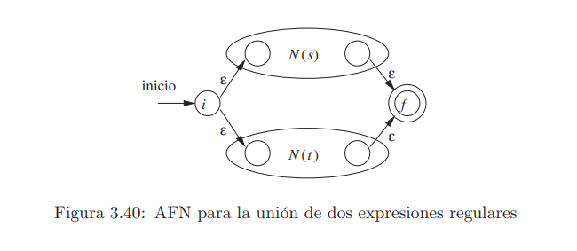
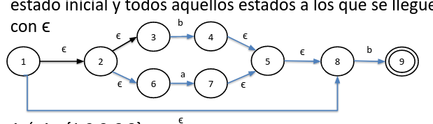

Analizador léxico  

\-Los analizadores léxicos pueden también aplicarse a lenguajes de consulta y recuperación de información  
\-El principal problema es la identificación de los patrones dentro de las cadenas  
\-En la programación dirigida por patrones facilita el uso de un lenguaje patrón-acción, otros lenguajes utilizan analizador de patrones  
\-El analizador léxico busca patrones para formar los lexemas

Expresiones regulares  

Entonces, sean r y s expresiones regulares de L( r ) y L(s) respectivamente  
(r) es una expresión regular que denota el lenguaje L(r)  
(r)|(s) es una expresión regular que denota el lenguaje L(r)UL(s)  
(r)(s) es una expresión regular que denota el lenguaje L(r)L(s)  
(r)\* es una expresión regular que denota el lenguaje (L(r))\*

Si un lenguaje puede definirse mediante una expresión regular se llama conjunto regular.  
Si dos expresiones regulares r y s denotan el mismo conjunto regular entonces son equivalentes r= s en (a|b) = (b|a)

Diagrama de transición

Un diagrama de transición es la representación gráfica de un patrón o expresión regular  
\-Está formado de nodos o círculos llamados estados  
\-Cada estado es una condición derivada del lexema  
\-Cada estado se conecta a otro a través de líneas etiquetadas con símbolos  
\-Un diagrama posee un estado de inicio y estados de finalización o aceptación.

Autómatas finitos

Un autómata finito es un reconocedor de cadenas y pueden de tipo AFN o AFD  
Un AFN:  
\-No tiene restricciones en las etiquetas, incluye ϵ  
\-Son fáciles de generar y difíciles de programar  
Un AFD:  
\-Limita las etiquetas de salida de los estados a una. No existe ϵ.  
\-Son fáciles de programar

AFN

Posee:  
\-Es un conjunto de estados S  
\-Un conjunto de símbolos de entrada Σ donde ϵ no pertenece a Σ  
\-Una función de transición para cada estado y para cada símbolo Σ U {ϵ}  
\-Un estado So de S que es el estado inicial  
\-Un conjunto de estados F, suconjunto de S, que representan los estados finales o de aceptación

AFD

Es un caso especial de AF donde:  
\-Cada estado tiene un solo destino con la misma etiqueta  
\-No hay épsilon

Algoritmo de McNaughton-Yamada-Thompson  
\-ϵ  
\-Para todo a en Σ  
\-Si N(s) y N(t) son autómatas para s y t  
entonces s|t

El primer paso es iniciar con el estado A compuesto por el estado inicial y todos aquellos estados a los que se llegue sólo con ϵ  

Así, A ={1,2,3,6,8}

Ahora se obtienen todas las combinaciones de los elementos de A con Ʃ, se sugiere comenzar desde el estado más pequeño.  
A ={1,2,3,6,8}

(A,a)= {7,5,8}=B  
(A,b)= {4,5,8,9} = C

(A,a)= {7,5,8}=B (A,b)= {4,5,8,9} = C  
(B,a)= {} (B,b)={9} = D  
(C,a)= {} (C,b)={9} = D  
(D,a)={} (D,b) = {}  
 

Sea un AFD M con un conjunto de estado S, un conjunto de entradas SIGMA, S0 y Estados de Aceptación F se obtiene un M’ con estados mínimos  
\-Constrúyase una partición inicial FI del conjunto de estado en dos grupos, tal que S-F  
\-Si FI n = FI hacer Fif = FI, si no, repetir  
\-Fif será un estado del conjunto, si s representa al conjunto entonces, M’ debe sustituir FIf-s por s