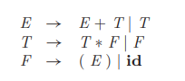
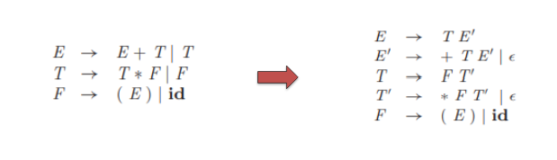
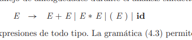
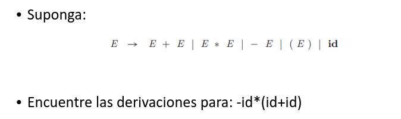
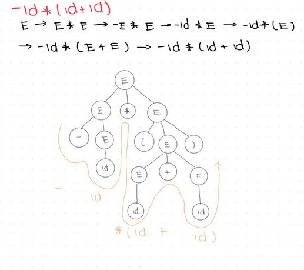
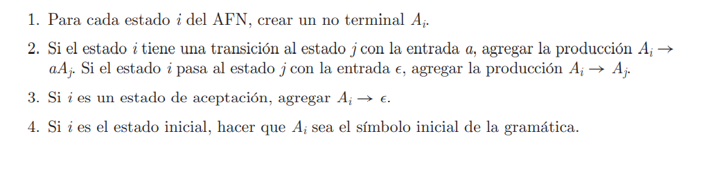

Objetivos:

\-Informar de errores con claridad y exactitud  
\-Recuperarse del error y continuar  
\-No retrasar programas correctos

Algunos metodos de analisis sintáctico detectan el error lo antes posible (metodos LL y LR)

Algunas estrategias de recuperacion son:  
\-Modo panico: Adecuado para cuando no hay erorres multiples en la misma proposicion  
\-A nivel de la frase: Corregir con alguna cadena que permita continuar (.,;)  
\-Producciones de error  
\-Corrección global

**Gramáticas**  
Las reglas de cada lenguaje indican la sintaxis.  
La sintaxis puede especificarse mediante gramáticas libres de contexto (notación BNF - Backus-Naur Form)

Una gramatica permite evolución iterativa de un lenguaje  
\-Integra fácilmente nuevas construcciones  
Hay tres tipos de analizadores:  
\-Métodos Universales  
\-Métodos Descendentes: Construyen el árbol de la raiz a las hojas  
\-Ascendentes: Construyen el árbol de las hojas hacia la raiz

Gramatica LL LR  
LL (Descendente)  
LR (Ascendente)

La gramática anterior es LR utilizada para análisis ascendente, para e descendente no puede utilizarse porque es recursiva por a izquierda.  
Observe:  

Existen métodos para eliminar la recursividad de este tipo de gramáticas obteniendo su equivalente:  
  
 Ambiguedad  
Una gramática es ambigua si permite 2 o más árboles de análisis sintáctico para una mima expresión, suponga la gramática:  

Gramatica libre de contexto:

\-Formalmente una gramática consiste en:  
\-Terminales (nombre del token- o simplemente token-)  
\-No terminales o variables sintácticas  
\-Un símbolo inicial en la primera producción  
\-Un conjunto de producciones

$$
E→E*E→-E*E→-id*E→-id*(E)→-id*(E+E)→-id*(id+id)
$$

  
 Conversion de un AFN a Gramática

**Derivacion:** Encontrar una cadena a partir del simbolo incial de la gramatica