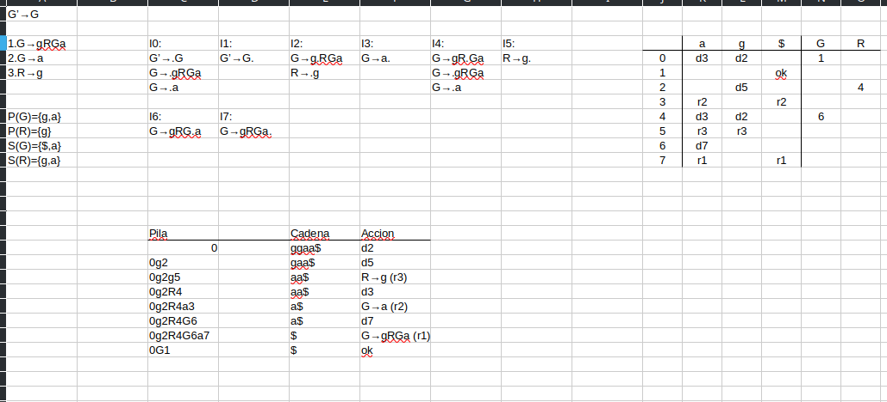
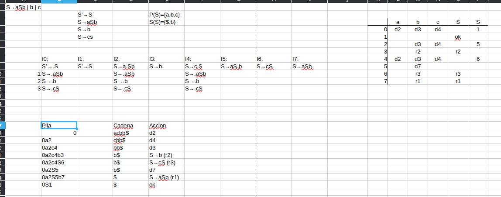

Un arbol de analisis sintactico puede construirse de raiz a hojas, pero tambien de hojas a raiz. Este es el caso del Analisis Sintactico ascendente por desplazamiento y reduccion, mejor conocido como LR, el proceso de construccion de hojas a raiz se le nombra reduccion de la cadena w para obtener el simbolo inicial de la gramatica.

Un mango es una subcadena que concuerda con el lado derecho de una produccion y cuya reduccion al no terminal del lado izquierdo representa un paso a la inversa de una derivacion por la derecha

Algunas gramaticas no pueden analizarse por desplazamiento y reduccion por tener conflicto en la accion, es decir, se debe desplazar o reducir (Conflicto de desplazamiento/reduccion) o no saber cual reduccion elegir (reduccion/reduccion)

&nbsp;-Una definición dirigida por la sintaxis son especificaciones de alto nivel para traducciones  
\-Los esquemas de traducción indican el orden de evaluación de las reglas semánticas  
\-Las definiciones y los esquemas de traducción revisan en un recorrido cada nodo del árbol sintáctico

Una regla semántica debe producir siempre el mismo resultado para cada cadena de entrada.

&nbsp;**Un compilador debe comprobar**  
\-Tipos de un operador u operando  
\-Flujo de control  
\-Break  
\-Unicidad  
\-Variables, casos  
\-Nombres  
\-En cierre de ciclos 

**Bytecodes** 

Opcode es el ensamblador de una máquina virtual  
Evita la dependencia de un Hardware específico  
Toma su nombre de la longitud que tiene cada operación  
Cada instrucción tiene un número de 0 a 255 seguido de parámetros  
Los parámetros son registros o direcciones de memoria  
Puede verse como código intermedio

&nbsp;

&nbsp;

&nbsp;

&nbsp;